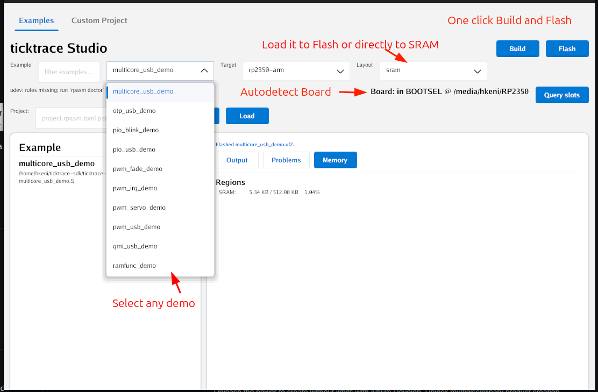
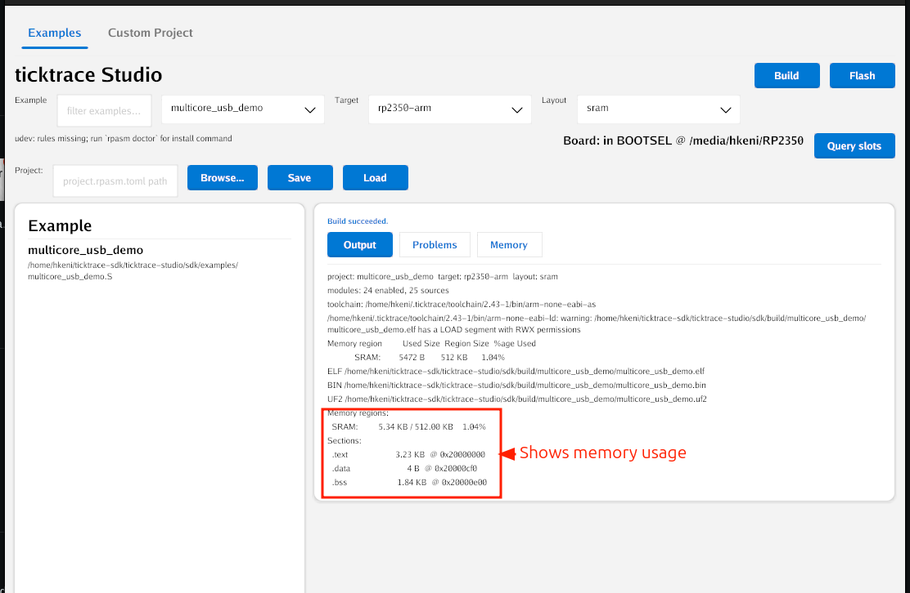
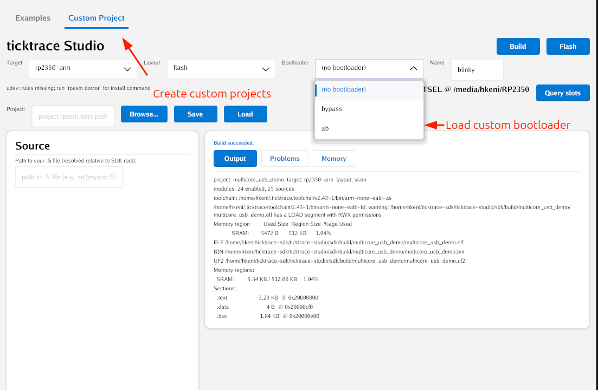

# ticktrace Studio

Visual configurator, build engine, and flashing tool for the [ticktrace Assembly SDK](https://github.com/ticktrace-sdk/rp-asm).  A pure-assembly firmware for the Raspberry Pi RP2040 and RP2350.

## What it is

ticktrace Studio lets you configure, build, and flash assembly-language firmware without touching Make, CMake, or Kconfig directly. Two interfaces ship side by side:

| Tool | What it does                                                         |
|------|----------------------------------------------------------------------|
| `rpasm` | CLI : build and flash from a terminal                                |
| `rpasm-studio` | GUI : visual catalog browser, build log, and one-click BOOTSEL flash |

## Download

Pre-built binaries for macOS (Apple Silicon), Windows (x86-64), and Linux (x86-64) are on the [Releases page](https://github.com/ticktrace-sdk/ticktrace-studio/releases). Each archive contains both `rpasm-studio` (GUI) and `rpasm` (CLI).

Intel Mac and Linux ARM64 builds are planned for a future release. In the meantime, Intel Mac users can install the toolchain via Homebrew (`brew install gcc-arm-embedded`) and build Studio from source — see below.

On first launch Studio checks for an ARM toolchain (`arm-none-eabi-as`/`-ld`/`-objcopy`) and offers to download a managed copy if none is found. From the CLI:

```sh
rpasm install-toolchain
```

The managed toolchain is a 5.6 MB minimal binutils build (no C compiler, because the SDK has nothing to compile) installed into `~/.ticktrace/toolchain/`. If you already have a toolchain via Homebrew, scoop, or ARM's official installer, Studio picks it up automatically — no download needed.

## Screenshots

### Examples catalog — pick a demo, build, and flash

The **Examples** tab lists every `.S` file in the SDK's `examples/` tree. Pick one from the filter-as-you-type dropdown, choose **SRAM** (fast iteration) or **Flash** (shipped firmware) as the target layout, and Studio auto-detects a Pico in BOOTSEL on `/media/<user>/RP2350`. **Build** + **Flash** are one click each.



### Memory view — every byte accounted for

After a successful build Studio shows the SRAM region usage and per-section breakdown (`.text`, `.data`, `.bss`) with their load addresses. The classic blinky lands at ~5.3 KB in SRAM; everything else from the cookbook fits comfortably under 16 KB.



### Custom projects — your own `.S`, with or without a bootloader

The **Custom Project** tab pairs a path to your own `.S` source with the same target + layout + bootloader options the Examples tab uses. The bootloader dropdown supports a plain image, the bootloader-bypass image (skip SSBL/TSBL during dev), or the full A/B slot bootloader for in-field updates.



## Build from source

- Go 1.26+ (matches `studio/go.mod`)
- [ticktrace SDK](https://github.com/ticktrace-sdk/rp-asm) (included as a git submodule at `sdk/`)
- An ARM toolchain — either system-installed, or installed via `rpasm install-toolchain` (above)

### GUI dependencies (rpasm-studio only)

`rpasm-studio` uses [ImmyGo](https://immygo.app), which builds on [Gio](https://gioui.org) and requires native graphics libraries. The CLI (`rpasm`) has no extra requirements.

| Platform | Command |
|----------|---------|
| Linux (Debian/Ubuntu) | `sudo apt install libwayland-dev libxkbcommon-x11-dev libgles2-mesa-dev libegl1-mesa-dev libx11-xcb-dev libvulkan-dev` |
| macOS | `xcode-select --install` |
| Windows | No additional dependencies |

## Getting started

```sh
git clone --recurse-submodules https://github.com/ticktrace-sdk/ticktrace-studio
cd ticktrace-studio

# Build the CLI
go build ./studio/cmd/rpasm

# Build the GUI
go build ./studio/cmd/rpasm-studio
```

The SDK submodule path is auto-detected. Override it with:

```sh
RPASM_SDK=/path/to/sdk rpasm build
```

## Repository layout

```
studio/          Go source — CLI, GUI, build engine, catalog parser
sdk/             ticktrace Assembly SDK (git submodule)
private/         Internal docs — not distributed
```

## License

AGPL-3.0-or-later. A commercial license is available from Amken LLC for use cases that cannot comply with the AGPL. See [`sdk/COMMERCIAL-LICENSE.md`](sdk/COMMERCIAL-LICENSE.md).
